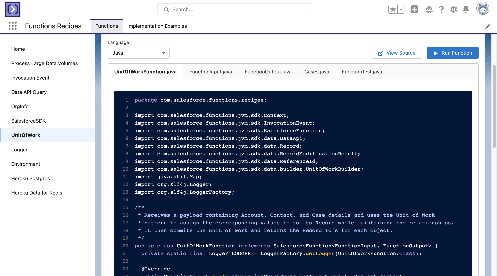

# Functions Recipes

[](https://github.com/trailheadapps/functions-recipes/actions?query=workflow%3ACI) [](https://codecov.io/gh/trailheadapps/functions-recipes) [](https://lerna.js.org/)


## Introduction

Salesforce Functions lets you use the Salesforce Platform for building event-driven, elastically scalable apps and experiences. Salesforce Functions is designed to boost developer productivity by reducing your infrastructure responsibilities and enabling you to build and integrate Functions-as-a-Service (FaaS) apps using the languages and tools of your choice.

**Functions Recipes** is a library of examples to help you getting started with Salesforce Functions and get used to their main features.

> **Note**
> This feature is a Beta Service. Customers may opt to try such Beta Service in its sole discretion. Any use of the Beta Service is subject to the applicable Beta Services Terms provided at [Agreements and Terms](https://www.salesforce.com/company/legal/agreements/).
>
> If you want to be part of the Invite Beta Service, please [nominate yourself](http://sfdc.co/functions-beta).

To learn more about Salesforce Functions please visit the [documentation center](https://developer.salesforce.com/docs/platform/functions/guide/index.html).

## Getting Started

You can use Functions both locally and deployed to a Salesforce Organization, if you don't have access to a Functions Enabled Org, you can still use the examples in this repository, please refer to the [Local Development](#local-development) section for more information.

### Prerequisites

Please refer to the [Install Prerequisites](https://developer.salesforce.com/docs/platform/functions/guide/install_intro#install-local-functions-tools) for detailed information about the necessary tools to start developing Salesforce Functions.

## Salesforce Org Setup and Deployment

For more information about how to configure your organization for Salesforce Functions, please refer to the [documentation](https://developer.salesforce.com/docs/platform/functions/guide/config-org#enable-functions-on-dev-hub-orgs)

**Prerequisite: Functions Enabled Org**

1. If you haven't already done so, authorize with your org and provide it with an alias (**fnrecipesorg** in the command below):

```
sfdx auth:web:login -d -a fnrecipesorg
```

2. Clone the functions-recipes repository:

```
git clone https://github.com/trailheadapps/functions-recipes
cd functions-recipes
```

3. Create a scratch org and provide it with an alias (**functions_recipes** in the command below):

```sh
sfdx force:org:create -s -f config/project-scratch-def.json -a functions_recipes
```

4. Push source app to the scratch org:

```sh
sfdx force:source:push -f
```

5. Assign the **FunctionsRecipes** permission set to the default user:

```sh
sfdx force:user:permset:assign -n FunctionsRecipes
```

## Salesforce Functions Deployment

For more information about how to deploy Functions to a Compute Environment and connect it to an org, please refer to to the [documentation](https://developer.salesforce.com/docs/platform/functions/guide/deploy#getting-a-list-of-deployed-functions)

1. Login to your Salesforce Functions account:

```
sfdx login:functions
```

2. Create a **Compute Environment** to deploy the functions and connected it to your org:

```sh
sfdx env:create:compute --connected-org=functions_recipes --setalias=fn_recipes
```

3. Deploy the functions

```sh
sfdx project:deploy:functions --connected-org=functions_recipes
```

## Functions Recipes App

After deploying both the Salesforce app and the functions, you can open the Salesforce org and navigate to the **Functions Recipes** application:

From there you'll be able to explore the source code and invoke the deployed functions.



## Local Development

Each individual function can be started and invoked locally using the Salesforce CLI, you can refer to each individual **README** for instructions on how to start and invoke each function locally.

### Java Functions

1. Introduction to Functions
   - [ProcessLargeData (Java)](functions/01_Intro_ProcessLargeData_Java)
1. `Context`
   - [SalesforceSDK (Java)](functions/03_Context_SalesforceSDK_Java)
   - [UnitOfWork (Java)](functions/03_Context_UnitOfWork_Java)

Note: Node.js functions can be found in the [`main`](https://github.com/trailheadapps/functions-recipes) branch.
